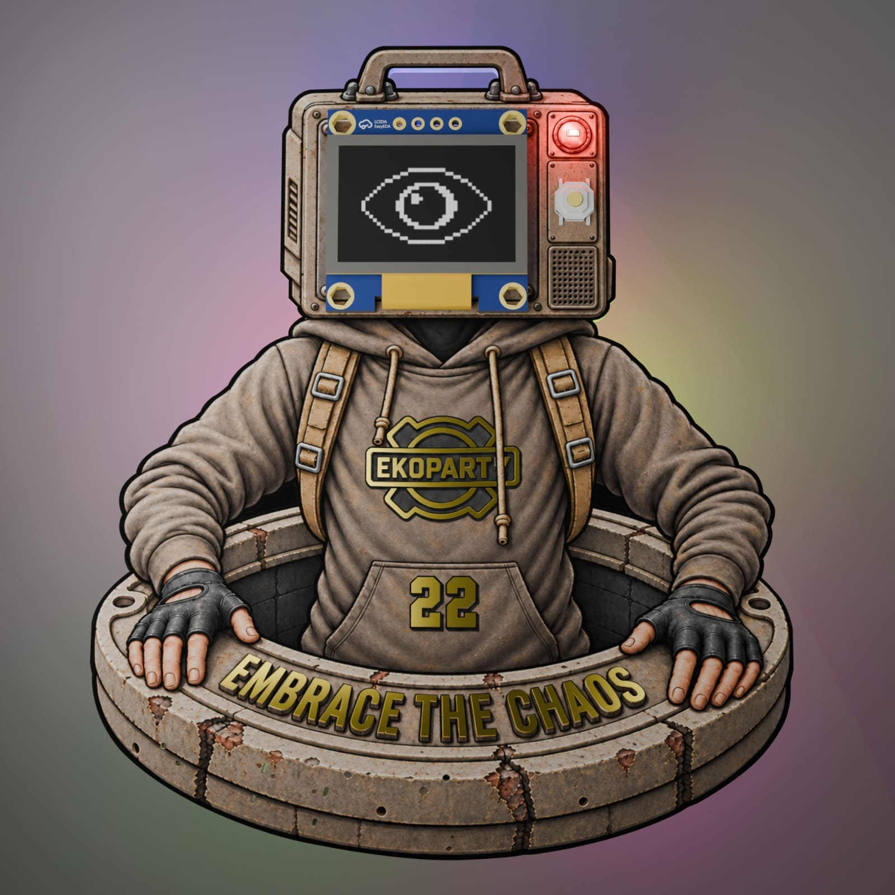

# Manual de uso del Ekoparty Badge



El Ekoparty Badge es un nodo Meshtastic con radio LoRa, conexión Bluetooth, pantalla OLED, buzzer, seis LEDs decorativos
traseros y un pixel independiente de estado. Puede intercambiar mensajes con otros nodos compatibles sin depender de
Internet ni de una red celular.

Este manual corresponde al PCB `ekoparty_badge_v1`.

## 1. Inicio rápido

1. Encender o alimentar el badge y esperar aproximadamente 12 segundos mientras se reproduce la intro.
2. Escanear el QR que aparece a continuación para abrir el manual web del proyecto.
3. Instalar y abrir la aplicación oficial Meshtastic en el teléfono.
4. Buscar dispositivos Bluetooth cercanos y seleccionar el badge.
5. Si se solicita pairing, ingresar o confirmar el PIN de seis dígitos que aparece en la OLED.
6. Esperar a que el status LED quede verde fijo: indica que la aplicación está conectada.
7. Desde la aplicación ya se pueden leer nodos y enviar mensajes broadcast o directos.

Durante la intro inicial de arranque el badge no acepta pairing Bluetooth. Esperar a que termine antes de intentar
conectarlo.

## 2. Controles y pantalla

El botón principal controla la navegación:

| Acción                                    | Resultado                                                       |
| ----------------------------------------- | --------------------------------------------------------------- |
| Pulsación corta con la pantalla apagada   | Despierta la OLED; esa primera pulsación no cambia de pantalla. |
| Pulsación corta con la pantalla encendida | Avanza al siguiente frame de Meshtastic.                        |
| Pulsación larga en el frame Ekoparty      | Abre el menú local `BADGE`.                                     |
| Pulsación larga en el frame QR            | No realiza ninguna acción especial.                             |
| Pulsación corta dentro de un menú         | Recorre las opciones.                                           |
| Pulsación larga dentro de un menú         | Confirma la opción seleccionada.                                |

La OLED permanece encendida durante 10 minutos por defecto después de una interacción o mensaje. El tiempo puede
cambiarse desde la configuración de pantalla de Meshtastic mediante `display.screen_on_secs`.

Los frames normales de Meshtastic muestran mensajes, nodos, estado del dispositivo, radio y Bluetooth. El frame
Ekoparty agrega la animación elegida y oculta su barra inferior para aprovechar toda la pantalla; una pulsación corta
sigue avanzando normalmente al siguiente frame.

Después del frame animado aparece, por defecto, el QR de `https://fabricamarciana.com/eko`. Al finalizar la intro
automática, el badge enfoca directamente ese QR. Desde allí, una pulsación corta recorre los nodos favoritos si existen
y luego vuelve al primer frame de Meshtastic; sin favoritos, vuelve directamente al primer frame. Si el manual está
oculto desde el menú local, la intro termina en el frame animado y el QR no forma parte de la navegación.

## 3. Menú local BADGE

Este menú sólo se abre con una pulsación larga mientras está visible el frame Ekoparty. Mientras permanece abierto, la
pantalla usa fondo negro y no dibuja animaciones detrás. `Volver` es siempre la primera opción.

```text
BADGE
├─ Volver
├─ Animacion idle
├─ Backlights
├─ Manual
├─ Status LED
├─ Acerca de
├─ Reproducir intro
└─ Restaurar
```

Las preferencias de animación, backlights, visibilidad del manual y status LED quedan guardadas localmente y sobreviven
a los reinicios y a una actualización normal por UF2.

Al confirmar cualquiera de esas preferencias, el menú se cierra y vuelve directamente al frame Ekoparty. `Acerca de`
permanece abierto para recorrer los créditos; desde allí, `Volver` regresa al menú principal.

### Animacion idle

Selecciona la animación del frame Ekoparty y el patrón correspondiente de los seis LEDs traseros:

| Opción        | Aspecto general                                                                                  |
| ------------- | ------------------------------------------------------------------------------------------------ |
| `Ojo`         | Respiración uniforme que recorre lentamente toda la paleta.                                      |
| `Logo glitch` | Paleta festiva con respiración y transiciones suaves entre distribuciones de colores diferentes. |
| `Calavera`    | Respiración rojo profundo con glitches ocasionales de alerta en naranja y amarillo.              |
| `Risa`        | Respiración ámbar uniforme interrumpida por glitches rosas, rojos y violetas.                    |
| `Mesh ARG`    | Usa el mismo patrón de backlights, paleta y transiciones suaves que `Logo glitch`.               |

`Ojo` es la opción predeterminada.

### Backlights

- `Apagados`: apaga los seis LEDs, también durante una reproducción de la intro.
- `Tenues`: reproduce los patrones con aproximadamente un cuarto del brillo máximo.
- `Brillantes`: reproduce los patrones con el brillo máximo. Es la opción predeterminada.

Los backlights no reaccionan a los mensajes. Esta opción tampoco apaga el pixel independiente de estado.

### Manual

- `Ocultar`: retira el QR del carrusel y hace que la intro automática termine en el frame animado.
- `Mostrar`: incluye el QR después del frame animado y hace que la intro automática termine en él. Es la opción
  predeterminada.

### Status LED

Controla qué señales muestra el pixel de estado:

| Opción           | Bluetooth | Mensajes | Batería crítica |
| ---------------- | --------: | -------: | --------------: |
| `Completo`       |        Sí |       Sí |              Sí |
| `Solo Bluetooth` |        Sí |       No |              Sí |
| `Solo mensajes`  |        No |       Sí |              Sí |
| `Apagado`        |        No |       No |              Sí |

La alerta roja de batería crítica no puede deshabilitarse desde este menú.

### Acerca de

Muestra automáticamente los créditos en español e inglés y finaliza con la versión de firmware y el commit corto. El
texto vuelve a comenzar al llegar al final. Mantener pulsado `Volver` para regresar al menú principal.

### Reproducir intro

Reproduce nuevamente la intro audiovisual sin desconectar Bluetooth ni bloquear un vínculo activo. Durante esos 12
segundos las pulsaciones no interrumpen la secuencia. El bloqueo de pairing se aplica únicamente a la intro del arranque.
Al terminar una reproducción manual, vuelve al frame Ekoparty animado en vez de cambiar al QR.

### Restaurar

Solicita confirmación y restaura únicamente las preferencias locales del badge:

- animación `Ojo`;
- backlights `Brillantes`;
- manual `Mostrar`;
- status LED en `Completo`.

No borra el propietario, los canales, las claves, los vínculos Bluetooth ni el resto de la configuración Meshtastic. No
es un factory reset.

## 4. Significado del status LED

En modo `Completo`, el comportamiento es el siguiente:

| Señal                                          | Significado                                                                                |
| ---------------------------------------------- | ------------------------------------------------------------------------------------------ |
| Dos destellos rojos cortos cada 3 segundos     | Batería presente en 5 % o menos, sin USB y sin carga. Tiene prioridad sobre todo lo demás. |
| Azul rápido, 250 ms encendido y 250 ms apagado | Pairing Bluetooth en curso.                                                                |
| Dos flashes ámbar, una sola vez                | Mensaje broadcast recibido por LoRa.                                                       |
| Cuatro flashes verdes, una sola vez            | Mensaje directo recibido por LoRa.                                                         |
| Verde tenue fijo                               | Teléfono conectado por Bluetooth.                                                          |
| Pulso azul tenue y corto cada 2 segundos       | Bluetooth habilitado, pero sin teléfono conectado.                                         |
| Apagado                                        | Bluetooth deshabilitado, o el modo local no permite mostrar el estado actual.              |

Las alertas de mensajes son ráfagas únicas; no se repiten. Una señal de mayor prioridad interrumpe temporalmente a las
demás. Si Bluetooth está deshabilitado desde Meshtastic, no se muestra su estado aunque esté elegido `Completo` o
`Solo Bluetooth`.

## 5. Conexión con Meshtastic

El badge viene preparado para el evento con estos valores principales:

- región LoRa `ANZ`, definida por la organización;
- preset `MEDIUM_FAST`;
- rol `CLIENT_MUTE`;
- GPS y MQTT deshabilitados;
- Message Bubbles habilitadas también en la OLED pequeña;
- mensajes rápidos y ringtone propios de Ekoparty.

No modificar la región ni el preset salvo indicación de la organización: los nodos necesitan parámetros compatibles
para comunicarse y la región debe respetar la normativa aplicable.

### Pairing Bluetooth

1. Esperar a que finalice la intro.
2. En la aplicación Meshtastic, iniciar la conexión con el badge encontrado.
3. Leer el PIN en la OLED. Durante el pairing se muestra sobre una pantalla negra para facilitar la lectura.
4. Ingresarlo o confirmarlo en el teléfono.
5. Comprobar que el status LED quede verde fijo.

Si la conexión falla, cancelar el intento en el teléfono y comenzar uno nuevo. Si existe un vínculo antiguo que impide
conectar, olvidar el dispositivo desde los ajustes Bluetooth del teléfono y repetir el pairing.

### Mensajes

- Un mensaje de canal o broadcast se envía a todos los nodos que compartan la configuración correspondiente.
- Un DM se dirige a un nodo concreto y depende de que ambos nodos hayan intercambiado su información y claves.
- Los mensajes recibidos aparecen como bubbles en la OLED y, según la configuración elegida, activan buzzer y status LED.

LoRa funciona independientemente de que el teléfono permanezca conectado. La aplicación es la interfaz para escribir,
leer el historial y modificar la configuración.

## 6. Sonido y modo silencioso

El buzzer se controla desde la configuración estándar del dispositivo en la aplicación Meshtastic. El campo suele
aparecer como `Buzzer mode` y ofrece:

| Modo                  | Comportamiento                                               |
| --------------------- | ------------------------------------------------------------ |
| `All enabled`         | Sonidos del sistema, feedback del botón y notificaciones.    |
| `Disabled`            | Silencio total.                                              |
| `Notifications only`  | Notificaciones y alertas, sin feedback del botón.            |
| `System only`         | Sonidos del sistema y botón, sin alertas de mensajes.        |
| `Direct message only` | Alertas sólo para mensajes directos, sin feedback del botón. |

El menú local del badge no cambia el buzzer. Del mismo modo, silenciar el buzzer no desactiva las señales visuales del
status LED; ambas funciones se configuran por separado.

De fábrica, cada mensaje produce una única notificación ascendente y breve, más aguda que el feedback de navegación. La
notificación no se repite; un ringtone o `Nag timeout` configurado previamente desde Meshtastic puede cambiar ese
comportamiento.

## 7. Alimentación y batería

- El USB alimenta el badge y también permite actualizar el firmware.
- Usar un cable y una fuente USB en buen estado.
- El nivel de batería se muestra mediante Meshtastic; al llegar a 5 % o menos sin USB aparece la alerta roja del status LED.
- Reducir consumo apagando los backlights, deshabilitando Bluetooth cuando no se use y dejando que la OLED se apague.
- No transmitir con el sistema de antena dañado o desconectado.

## 8. Actualizar el firmware por UF2

Las versiones estables se publican en:

[Releases del Ekoparty Badge 2026](https://github.com/marsfactory/ekoparty-badge-2026/releases)

Usar exclusivamente el archivo cuyo nombre contenga:

```text
firmware-ekoparty_badge_v1-...uf2
```

### Procedimiento

1. Descargar el UF2 y, cuando sea posible, comprobarlo con `SHA256SUMS`.
2. Desconectar el badge del USB.
3. Mantener pulsado el botón DFU rotulado `nRF_RESET` y volver a conectarlo.
4. Soltar el botón cuando aparezca la unidad USB `EKOBOOT`.
5. Copiar el UF2 dentro de `EKOBOOT`.
6. Esperar el reinicio automático y la intro del badge.
7. Abrir `BADGE → Acerca de` y comprobar la versión instalada.

La unidad `EKOBOOT` puede desaparecer pocos segundos después de comenzar la copia. Es normal: el bootloader desmonta
el volumen al aceptar el firmware y reinicia el badge. Algunos gestores de archivos pueden mostrar un error tardío como
“No such file or directory” porque intentan consultar el archivo después de que la unidad ya se desmontó. Confirmar el
resultado observando el arranque y la versión en `Acerca de`.

Una actualización UF2 normal no requiere el programador SWD. Si `EKOBOOT` no aparece o el badge no arranca, seguir la
guía técnica de compilación y carga: [BUILD.md](BUILD.md).

## 9. Problemas frecuentes

### La pantalla está apagada

Hacer una pulsación corta para despertarla. La primera pulsación se consume en el encendido; hacer otra para avanzar de
frame. Si no responde, conectar USB y volver a probar.

### No aparece el badge en la aplicación

- Esperar a que termine la intro.
- Confirmar que Bluetooth esté habilitado en el teléfono y en Meshtastic.
- Acercar el teléfono al badge.
- Olvidar un vínculo Bluetooth anterior y repetir el pairing.
- Reiniciar la aplicación antes de modificar configuraciones avanzadas.

### No llegan mensajes LoRa

- Confirmar que ambos nodos usen región, preset y canal compatibles.
- Esperar el intercambio inicial de información de nodos antes de probar un DM.
- Probar primero un mensaje broadcast.
- Alejar el badge de fuentes intensas de interferencia y comprobar el estado físico de la antena.

### No suena el buzzer

Revisar `Buzzer mode` en la aplicación. `Disabled` silencia todo, `System only` omite mensajes y `Direct message only`
omite los mensajes broadcast.

### Los LEDs decorativos no encienden

Abrir `BADGE → Backlights` y elegir `Tenues` o `Brillantes`. El status LED es independiente y puede continuar funcionando
aunque los seis backlights estén apagados.

### El status LED no muestra Bluetooth o mensajes

Revisar `BADGE → Status LED`. `Solo Bluetooth`, `Solo mensajes` y `Apagado` filtran señales de forma intencional. La
alerta roja de batería crítica continúa activa en todos los modos.

### EKOBOOT desaparece durante la copia

Normalmente indica que el UF2 fue aceptado. Esperar el reinicio y comprobar la versión en `Acerca de`. Si el badge vuelve
siempre a EKOBOOT y nunca inicia la aplicación, descargar de nuevo el UF2 correcto de badge v1 y verificar su checksum.

## 10. Alcance de las restauraciones

Hay acciones con efectos muy diferentes:

| Acción                                | Qué modifica                                                                                |
| ------------------------------------- | ------------------------------------------------------------------------------------------- |
| `BADGE → Restaurar`                   | Sólo animación, backlights, visibilidad del manual y modo del status LED.                  |
| Olvidar el dispositivo en el teléfono | Sólo el vínculo Bluetooth guardado en el teléfono.                                          |
| Factory reset de Meshtastic           | Configuración, identidad y posiblemente claves del nodo; no usarlo como solución rutinaria. |
| Actualización UF2                     | Reemplaza la aplicación y normalmente conserva los datos locales.                           |

Antes de hacer un factory reset, guardar canales y configuración importantes. La regeneración de identidad o claves
puede impedir temporalmente los mensajes directos hasta que los nodos vuelvan a intercambiar información.

## 11. Más información

- Versiones y checksums: [Releases](https://github.com/marsfactory/ekoparty-badge-2026/releases).
- Compilación y primer flash: [BUILD.md](BUILD.md).
- Conexiones del PCB: [PIN-MAP.md](../badge-hardware/PIN-MAP.md).

Los créditos completos del equipo pueden consultarse directamente en `BADGE → Acerca de`.
