# Ekoparty Badge 2026

El Ekoparty Badge es un nodo Meshtastic con radio LoRa. Se conecta al teléfono por Bluetooth para escribir mensajes y configurar el dispositivo, pero sigue recibiendo y enviando mensajes por LoRa sin el teléfono conectado.

**[Abrir la guía web completa](https://marsfactory.github.io/ekoparty-badge-2026/)** · [Firmware y versiones](https://github.com/marsfactory/ekoparty-badge-2026/releases) · [Código del proyecto](https://github.com/marsfactory/ekoparty-badge-2026)

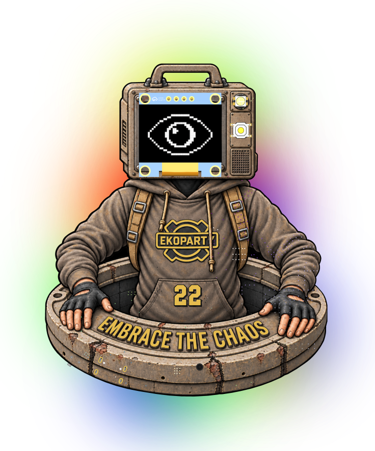

## Conocé el badge

El PCB `ekoparty_badge_v1` usa un nRF52840, radio SX1262, pantalla OLED, un botón de navegación, USB-C, buzzer, seis LEDs traseros y un pixel independiente de estado. Se alimenta con una batería recargable 18650 o por USB.

### Frente

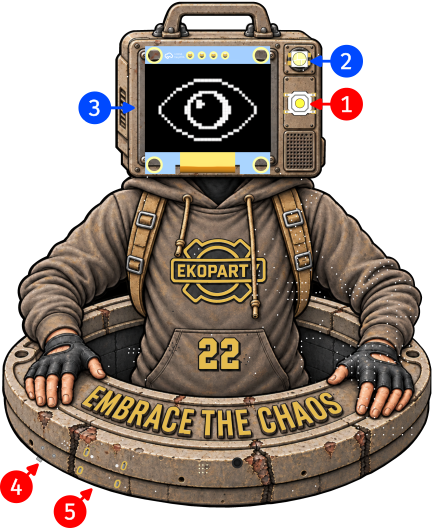

1. **Botón de navegación:** una pulsación corta despierta la OLED o avanza de pantalla; una larga abre menús y confirma opciones. Una pulsación muy prolongada solicita el apagado por software.
2. **Pixel de estado:** muestra Bluetooth, mensajes recibidos y batería crítica. Pulsa azul cuando Bluetooth está disponible, queda verde tenue al conectar el teléfono, da dos destellos ámbar por un mensaje de canal y cuatro verdes por uno directo. La alerta roja indica batería crítica.
3. **Pantalla OLED:** muestra el estado de Meshtastic, los mensajes y los menús. Se apaga tras unos 10 minutos de inactividad y se despierta con el botón o al recibir un mensaje.
4. **Interruptor OFF/ON:** hacia la izquierda corta la alimentación; hacia la derecha enciende el badge.
5. **Puerto USB-C:** permite alimentar y cargar el badge, usar la conexión serial y copiar actualizaciones UF2 mediante EKOBOOT.

### Dorso

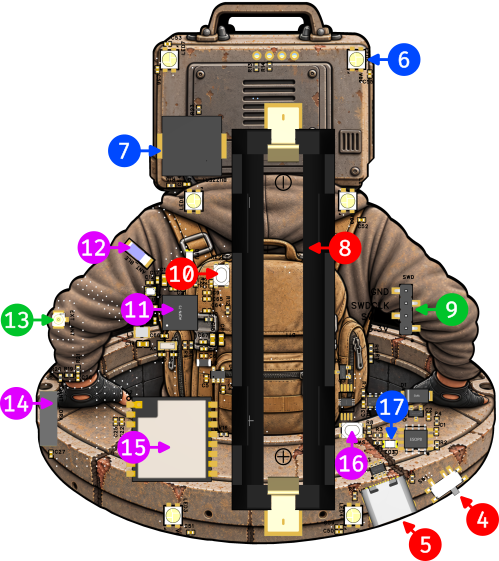

6. **Backlights:** seis LEDs decorativos que siguen la animación elegida. Son independientes del pixel de estado.
7. **Buzzer:** emite avisos de mensajes y sonidos de navegación, según la configuración.
8. **Portapilas 18650:** aloja la batería recargable. Respetá la polaridad indicada: positivo abajo y negativo arriba.
9. **Puerto SWD:** conexión de programación para el primer flash o la recuperación del bootloader; no se usa en una actualización UF2 normal.
10. **Botón DFU (`nRF_RESET`):** para entrar en EKOBOOT, apagá el badge, mantené presionado este botón mientras conectás el USB-C y encendé el badge sin soltarlo. Soltalo cuando aparezca la unidad `EKOBOOT` en la computadora.
11. **Microcontrolador nRF52840:** ejecuta el firmware y proporciona Bluetooth.
12. **Antena Bluetooth:** antena del enlace entre badge y teléfono.
13. **Conector para antena externa:** para usarlo, primero hay que mover el puente de `R19` a `R21`; ver [Conexión de antena externa](#conexión-de-antena-externa).
14. **Antena LoRa integrada:** antena de radio incorporada al PCB.
15. **Módulo LoRa Ai-Thinker Ra-01SH:** integra la radio SX1262 usada para la red mesh.
16. **Botón LOCKED:** desbloquea el módulo de carga en casos específicos; no hace falta pulsarlo durante el uso habitual.
17. **Indicador de carga:** rojo mientras carga la batería y azul cuando está cargada.

Comprobá la polaridad de la batería y el estado de la antena antes de encenderlo. No transmitas con la antena dañada o desconectada.

## Primer Inicio

1. Mové el interruptor a **ON** y esperá unos 12 segundos a que termine la intro. El QR de la OLED abre esta guía.
2. Instalá la [aplicación oficial Meshtastic](https://meshtastic.org/) en tu teléfono, activá Bluetooth y abrí la app.

   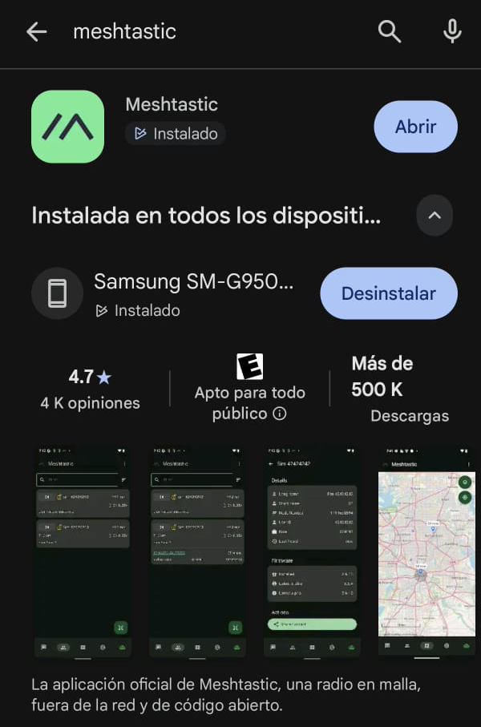

3. En **Connection**, elegí **Bluetooth** y pulsá **Scan for Bluetooth devices**. Para reconocer tu nodo, avanzá con pulsaciones cortas del botón del badge hasta la pantalla **Home**. Compará su identificador corto con la lista de la app (por ejemplo, `E001` en `E001_d8aa`) y seleccioná el dispositivo.

   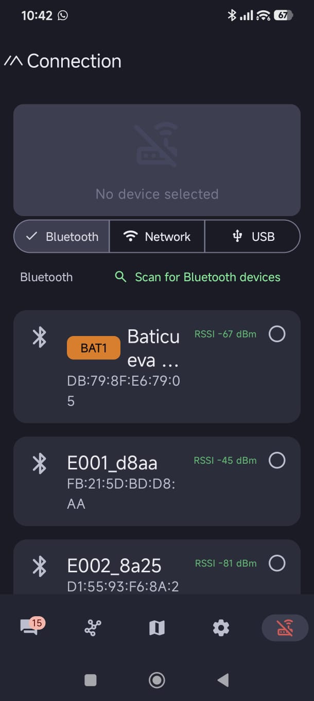

   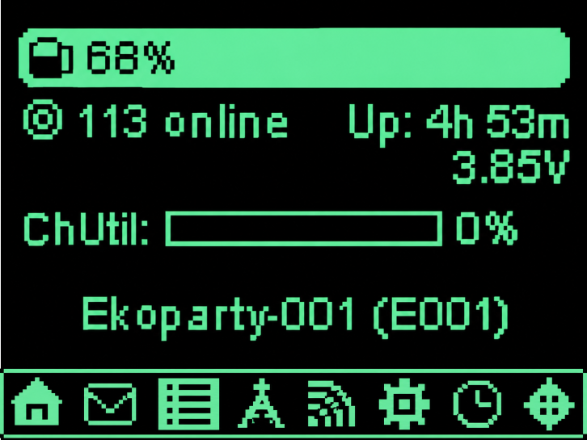

4. Leé el PIN que aparece en la OLED e ingresalo en el teléfono.
5. Esperá la sincronización. El pixel de estado queda **verde tenue fijo** mientras el teléfono está conectado. Si falla, comprobá que Bluetooth esté encendido, cerrá y reabrí la app, y repetí la búsqueda. El PIN normalmente se pide una sola vez. También podés conectar el badge al teléfono con un cable USB-C de datos y elegir **USB** en **Connection**, si el teléfono admite esa conexión.

Las capturas de esta guía corresponden a Android; en iPhone o en otras versiones de la app algunos controles pueden verse distintos. Si no aparece el badge, esperá al final de la intro, acercá el teléfono y repetí la búsqueda.

## Personalizá el nombre de tu badge

Con el badge conectado a la app Meshtastic:

1. Abrí la pestaña **Settings** (engranaje) y entrá en **User**.

   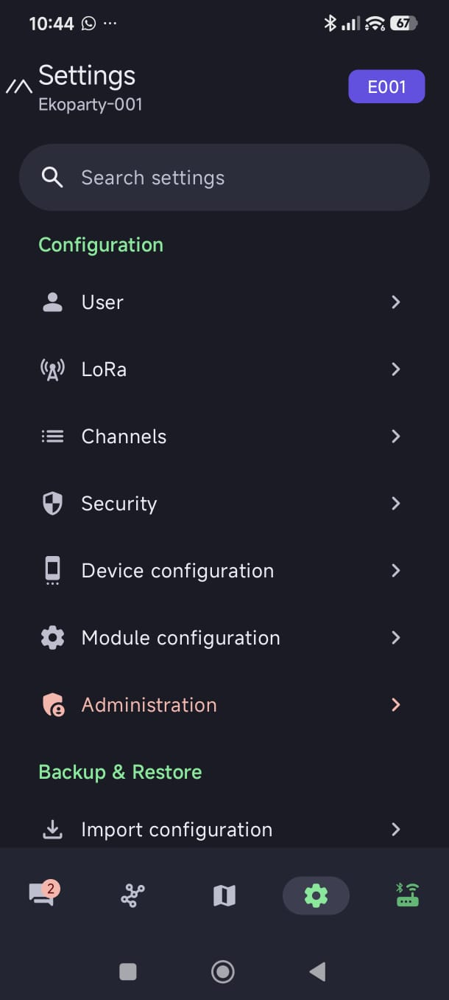

2. Cambiá **Long Name** (nombre largo) y **Short Name** (nombre corto) como prefieras. Podés incluir emojis en el nombre largo 🙂. Pulsá **Save** para guardar.

   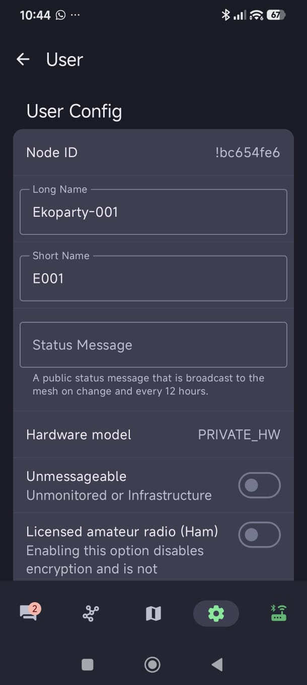

## Cómo funciona la red

- **Bluetooth** conecta el teléfono con *tu* badge. **LoRa** conecta el badge con otros nodos sin Internet ni datos móviles.
- Un **canal** es una conversación compartida. Los participantes necesitan una configuración compatible.
- Un **mensaje directo** se dirige a un nodo concreto. Puede tardar en estar disponible hasta que ambos nodos intercambien información.

Para probar la red desde la app, abrí **Conversations**, elegí un canal compartido, escribí en **Type a message** y enviá. La lista **Nodes** muestra los nodos que tu badge ha escuchado. La [guía web](https://marsfactory.github.io/ekoparty-badge-2026/#mensajes-app) incluye capturas del envío por canal y del mensaje directo.

## Enviar una frase usando sólo el badge

Con pulsaciones cortas recorrés pantallas u opciones; con una pulsación larga abrís el menú de la pantalla actual o confirmás. La primera pulsación corta, si la OLED estaba apagada, sólo la despierta.

1. Avanzá hasta la pantalla **Messages** y mantené pulsado el botón.
2. Si hay mensajes, elegí **Reply → With Preset**. Si aún no hay conversaciones, abrí la opción de mensaje predefinido nuevo.
3. Comprobá el destino en la línea `To:`. `#` indica un canal y `@` un nodo; **[Select Destination]** permite cambiarlo.
4. Recorré las frases, elegí una y mantené pulsado para enviarla. La pantalla muestra **Sending...**.

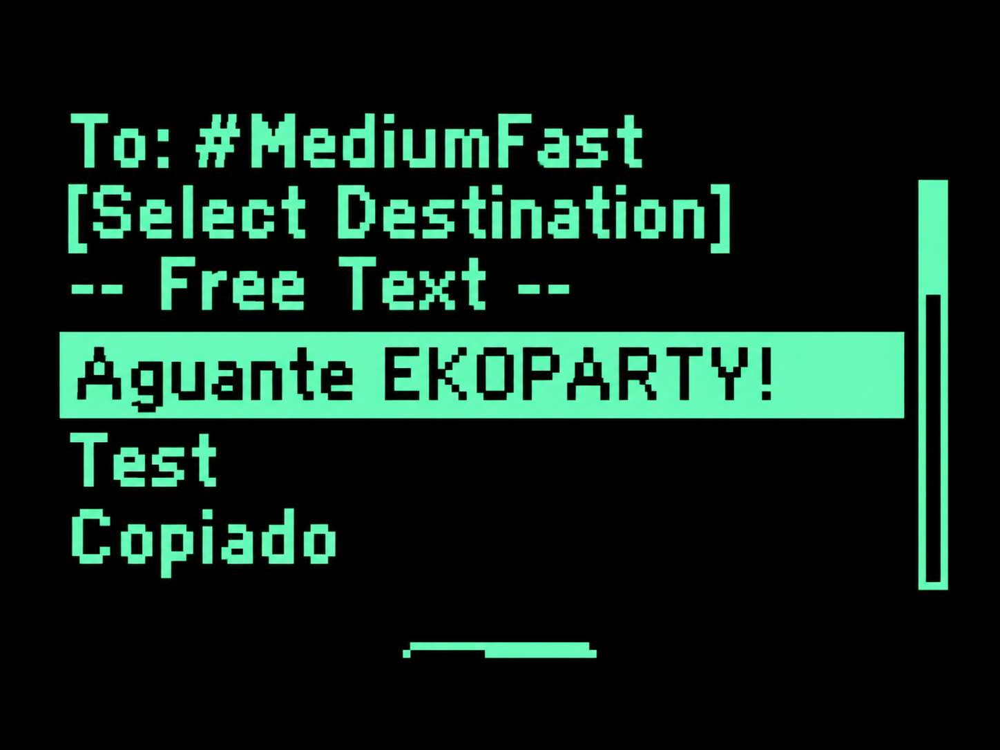

El firmware incluye frases como `Aguante EKOPARTY!`, `Test` y `Copiado`. El teléfono no necesita estar conectado para enviarlas. El [procedimiento ilustrado](https://marsfactory.github.io/ekoparty-badge-2026/#sin-telefono) muestra las pantallas paso a paso.

## Tu Badge

El menú **BADGE** se abre con una pulsación larga **desde la pantalla animada Ekoparty**. Una pulsación larga en la pantalla del QR no abre ninguna opción especial. Dentro de un menú, una pulsación corta recorre las opciones y una larga confirma. Los menús se muestran sobre fondo negro, sin animaciones detrás, y **Volver** es siempre la primera opción.

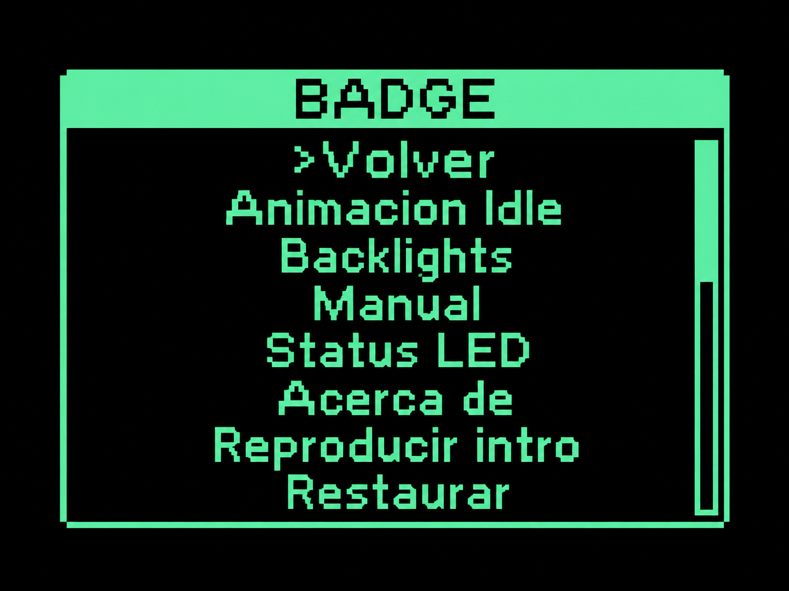

```text
BADGE
├─ Volver
├─ Animacion idle
├─ Backlights
├─ Manual
├─ Status LED
├─ Acerca de
├─ Reproducir intro
└─ Restaurar
```

Las preferencias de animación, backlights, visibilidad del QR y status LED quedan guardadas en el badge: sobreviven a los reinicios y a una actualización UF2 normal. Al confirmar un cambio, el menú se cierra y vuelve a la pantalla animada Ekoparty. **Acerca de** permanece abierto hasta que elegís **Volver**.

### Animación idle

Esta opción cambia la pantalla Ekoparty y el patrón de los seis LEDs traseros:

| Opción | Aspecto |
| --- | --- |
| **Ojo** | El brillo sube y baja suavemente mientras recorre la paleta de colores. Es la opción predeterminada. |
| **Logo glitch** | Colores festivos con transiciones suaves entre distintas distribuciones de color. |
| **Calavera** | Rojo profundo con cambios breves en naranja y amarillo. |
| **Risa** | Ámbar con cambios breves en rosa, rojo y violeta. |
| **Mesh ARG** | Usa el mismo patrón de luces y colores que **Logo glitch**. |

### Backlights y QR

En **Backlights** podés elegir **Apagados**, **Tenues** (aproximadamente un cuarto del brillo máximo) o **Brillantes** (brillo máximo, valor predeterminado). **Apagados** también mantiene las luces traseras apagadas durante la intro. Estas luces no reaccionan a los mensajes y son independientes del pixel de estado.

En **Manual**, **Mostrar** deja el QR en el carrusel y al final de la intro automática; es el valor predeterminado. **Ocultar** retira el QR del carrusel y hace que la intro automática termine en la pantalla animada.

### Status LED

Esta opción controla qué avisos muestra el pixel de estado. La alerta roja de batería crítica permanece activa en todos los modos.

| Modo | Bluetooth | Mensajes | Batería crítica |
| --- | --- | --- | --- |
| **Completo** | Sí | Sí | Sí |
| **Solo Bluetooth** | Sí | No | Sí |
| **Solo mensajes** | No | Sí | Sí |
| **Apagado** | No | No | Sí |

Con el modo predeterminado **Completo**, las señales son:

| Señal | Significado |
| --- | --- |
| Dos destellos rojos cada 3 segundos | Batería presente al 5 % o menos, sin USB ni carga. Tiene prioridad sobre las demás señales. |
| Azul rápido: 250 ms encendido y 250 ms apagado | Emparejamiento Bluetooth en curso. |
| Dos destellos ámbar, una sola vez | Mensaje de canal recibido por LoRa. |
| Cuatro destellos verdes, una sola vez | Mensaje directo recibido por LoRa. |
| Verde tenue fijo | Teléfono conectado por Bluetooth. |
| Pulso azul tenue cada 2 segundos | Bluetooth habilitado, sin teléfono conectado. |
| Apagado | Bluetooth deshabilitado o el modo elegido oculta la señal actual. |

Las ráfagas de mensajes no se repiten. Una señal de mayor prioridad interrumpe temporalmente a las demás. Si deshabilitás Bluetooth desde Meshtastic, el pixel no muestra su estado aunque hayas elegido **Completo** o **Solo Bluetooth**.

### Acerca de, intro y restauración

**Acerca de** recorre automáticamente los créditos en español e inglés, la versión del firmware y el commit corto. Al terminar, vuelve a empezar. Para salir, seleccioná **Volver** y mantené pulsado el botón.

**Reproducir intro** vuelve a mostrar la secuencia audiovisual, de unos 12 segundos. Las pulsaciones no la interrumpen y un vínculo Bluetooth activo sigue conectado. El bloqueo temporal del emparejamiento se aplica sólo a la intro del arranque. Al terminar la reproducción manual, vuelve a la pantalla animada Ekoparty, aunque el QR esté visible en el carrusel.

**Restaurar** pide confirmación y devuelve únicamente estas preferencias locales a sus valores iniciales: **Ojo**, backlights **Brillantes**, QR **Mostrar** y status LED **Completo**. No borra el nombre o propietario del nodo, los canales, las claves, los vínculos Bluetooth ni otras opciones Meshtastic; no equivale a un restablecimiento de fábrica.

## Sonido y modo silencioso

El buzzer se configura desde **Buzzer mode** en la configuración del dispositivo de la app Meshtastic. Los nombres pueden variar según la versión de la app:

| Modo | Qué se escucha |
| --- | --- |
| **All enabled** | Sonidos del sistema, respuesta al botón y notificaciones. |
| **Disabled** | Silencio total. |
| **Notifications only** | Notificaciones y alertas, sin respuesta al botón. |
| **System only** | Sistema y botón, sin alertas de mensajes. |
| **Direct message only** | Alertas de mensajes directos, sin respuesta al botón. |

El menú **BADGE** no cambia el buzzer. Silenciarlo tampoco desactiva el pixel de estado: ambas funciones se configuran por separado. De fábrica, cada mensaje produce un aviso breve y ascendente, más agudo que el sonido de navegación, que no se repite. Un tono o **Nag timeout** configurado después desde Meshtastic puede cambiar ese comportamiento.

## Conocé más tu badge

El badge funciona como un nodo Meshtastic. Una pulsación corta recorre los frames de la OLED; si estaba apagada, la primera sólo la despierta. La [galería web de pantallas](https://marsfactory.github.io/ekoparty-badge-2026/#pantallas-meshtastic) muestra todos los ejemplos. Para funciones más avanzadas, consultá la [documentación oficial de Meshtastic](https://meshtastic.org/docs/).

| Pantalla | Qué muestra |
| --- | --- |
| **Home** | Batería, nodos conocidos, tiempo encendido y nombre del badge. |
| **Messages** | Mensajes y acciones para responder con frases predefinidas. |
| **Last Heard** | Nodos escuchados y tiempo desde su última señal. |
| **Distance** | Distancia a nodos con posición conocida; `?` si falta el dato. |
| **LoRa** | Región, preset, frecuencia, rol y uso del canal. |
| **System** | Versión, tiempo encendido y estado del sistema y de la app. |
| **Clock** | Hora, fecha y batería cuando hay una hora válida. |


## Configuraciones de LoRa, roles y mapa

El firmware del evento llega con región **`ANZ`**, preset de radio **`MEDIUM_FAST`**, rol **`CLIENT_MUTE`** y **3 saltos máximos**. La región `ANZ` selecciona la banda ISM que Meshtastic indica para Argentina. `MEDIUM_FAST` es el preset elegido para la red del evento en CABA; no es un canal.

De fábrica, el GPS figura como no presente y MQTT está deshabilitado. Las **Message Bubbles** están habilitadas para mostrar los mensajes en la OLED pequeña; las frases predefinidas y el tono de aviso son propios de Ekoparty.

En la app de Android, abrí **Settings → LoRa** para ver región, preset y **Max Hops**. En otra provincia de Argentina, la región sigue siendo `ANZ`, pero el preset y los canales de la red pueden variar. En otro país, elegí la región permitida allí.

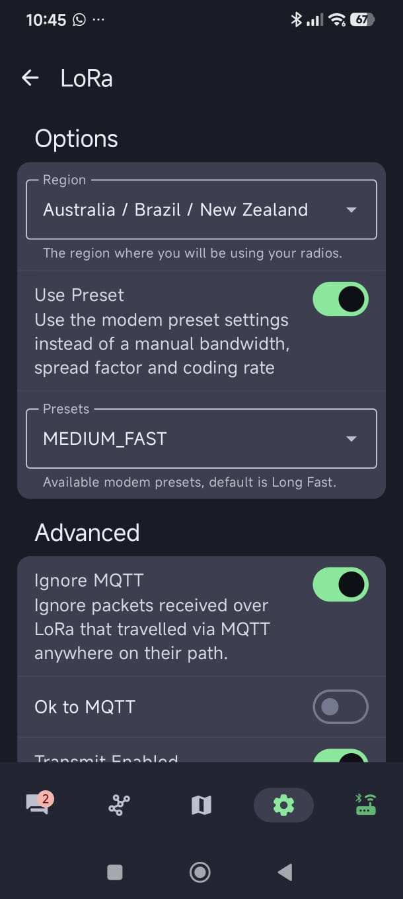

En **Settings → Device configuration → Device** podés cambiar **Device Role**. **Client Mute** envía y recibe sin retransmitir mensajes ajenos; **Client** puede retransmitir cuando hace falta; **Router** se reserva para infraestructura bien ubicada; **Tracker** prioriza avisos de posición. Los roles especializados pueden cambiar el uso de la pantalla o Bluetooth.

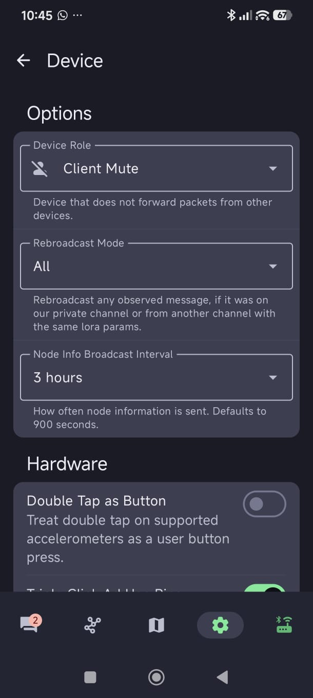

La pestaña **Mesh Map** muestra nodos que comparten posición. Este badge no tiene GPS integrado: podés establecer una posición fija en **Settings → Device configuration → Position** o permitir que la app comparta la ubicación GPS del teléfono mientras está conectado. Compartir tu posición es opcional.

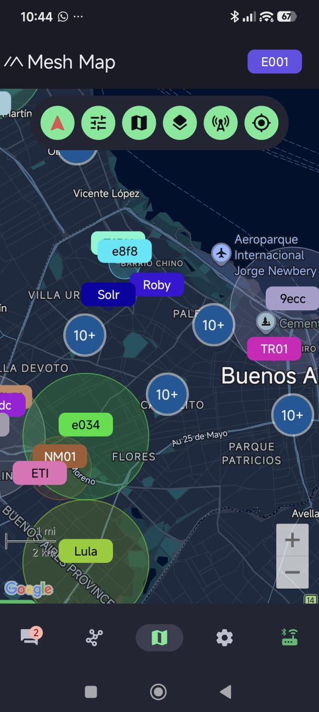

Un **restablecimiento de fábrica de Meshtastic** borra tu configuración personal y vuelve a cargar los valores iniciales de esta compilación: `ANZ`, `MEDIUM_FAST`, `CLIENT_MUTE` y 3 saltos. Después podés modificarlos. **BADGE → Restaurar** sólo afecta las preferencias visuales del badge.

Más detalles: [LoRa](https://meshtastic.org/docs/configuration/radio/lora/), [roles](https://meshtastic.org/docs/configuration/radio/device/), [posición](https://meshtastic.org/docs/configuration/radio/position/) y [regiones por país](https://meshtastic.org/docs/configuration/region-by-country/).

## Actualizar el firmware por UF2

Descargá desde [Releases](https://github.com/marsfactory/ekoparty-badge-2026/releases) un archivo `.uf2` para **`ekoparty_badge_v1`**; el nombre de una release puede tener la forma `firmware-ekoparty_badge_v1-...uf2`. Si la release incluye `SHA256SUMS`, verificá la descarga antes de copiarla. Una actualización UF2 normal no requiere programador SWD.

1. Apagá el badge con el interruptor en **OFF** y desconectá el USB-C si estaba conectado.
2. Mantené presionado el botón DFU del dorso, rotulado `nRF_RESET`, y, sin soltarlo, conectá el USB-C a la computadora.
3. Con el botón todavía presionado, mové el interruptor a **ON**. Mantenelo hasta que aparezca la unidad USB **`EKOBOOT`**.
4. Soltá el botón y copiá el archivo `.uf2` a `EKOBOOT`.
5. Esperá el reinicio automático y la intro. Abrí **BADGE → Acerca de** y comprobá la versión instalada.

La unidad `EKOBOOT` puede desaparecer durante la copia: el bootloader desmonta el volumen al aceptar el firmware y reinicia el badge. Algunos gestores de archivos muestran entonces un error tardío como “No such file or directory”. Comprobá el resultado observando el arranque y la versión en **Acerca de**. Si `EKOBOOT` no aparece o el badge no inicia, seguí la [guía técnica de compilación y carga](BUILD.md).

## Conexión de antena externa

De fábrica, una resistencia de **0 Ω en `R19`** actúa como puente entre la radio LoRa y la antena integrada del PCB. Para usar el conector IPEX con una antena externa:

1. Apagá el badge y retirá el cable USB-C y la batería 18650.
2. Desoldá la resistencia de 0 Ω de `R19` y soldala en los pads `R21`. Así la señal LoRa se dirige al conector IPEX.
3. Conectá la antena externa al IPEX **antes** de volver a colocar la batería o conectar el USB-C y encender el badge.

**Importante:** no enciendas el badge sin una antena conectada. Después de mover el puente a `R21`, conectá siempre la antena externa antes de encenderlo.

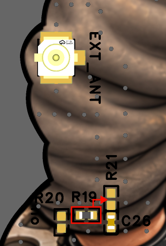

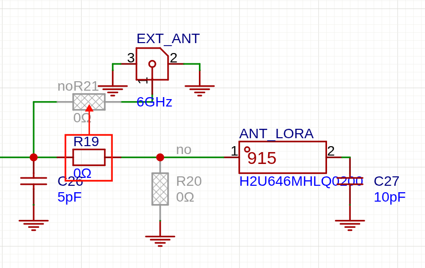

## Más información

- [Guía web completa e imprimible](https://marsfactory.github.io/ekoparty-badge-2026/): opciones, señales del pixel de estado, sonido, batería, problemas frecuentes y actualización UF2.
- [Versiones del firmware](https://github.com/marsfactory/ekoparty-badge-2026/releases).
- [Compilación y carga](BUILD.md).
- [Pinmap y hardware](../badge-hardware/PIN-MAP.md).
- [Mesh Argentina](https://mesharg.com.ar/) y su [grupo de Telegram](https://t.me/meshtastic_argentina) para aprender más y resolver dudas sobre Meshtastic.

## Especificaciones técnicas

Estos son los componentes principales del PCB `ekoparty_badge_v1`:

- **Microcontrolador:** Nordic `nRF52840-QIAA-R`, encargado del firmware y la conexión Bluetooth.
- **Radio LoRa:** módulo Ai-Thinker `Ra-01SH` con transceptor Semtech `SX1262`.
- **Pantalla:** OLED `HS96L03W2C03` conectada por I²C.
- **Iluminación:** seis LEDs traseros `SK6812mini-012` y un séptimo pixel independiente para el estado.
- **Sonido:** buzzer piezoeléctrico pasivo.
- **Alimentación:** batería recargable 18650 o puerto USB-C.
- **Carga y protección:** cargador `TP4056` y protección de batería `DW01` con MOSFET `8205A`.
- **Regulación:** `AP2112K-3.3` para la línea de 3,3 V.
- **Antenas:** antena Bluetooth `RFANT5220110A0T`, antena LoRa integrada en el PCB y conector IPEX para una externa.
- **Controles y programación:** botón de navegación, botón DFU, interruptor OFF/ON y conector SWD.

Para el detalle eléctrico, consultá el [esquema del PCB](../badge-hardware/SCH_Schematic1_2026-09-11.pdf) y el [mapa de pines](../badge-hardware/PIN-MAP.md).

## Créditos

Este badge fue creado en el marco de la Ekoparty 2026 por el equipo de desarrollo:

- **Diseño de hardware:** [Lucas Leal](https://www.instagram.com/lucas.__.leal/).
- **Identidad visual y adaptación de firmware:** [Nicolas Restbergs, a.k.a. Fabrica Marciana](https://fabricamarciana.com/).
- **Concepto y coordinación:** [Jorge Crowe, a.k.a. Monstruo Midi](https://www.jcrowe.xyz/).

Buenos Aires, 2026.
